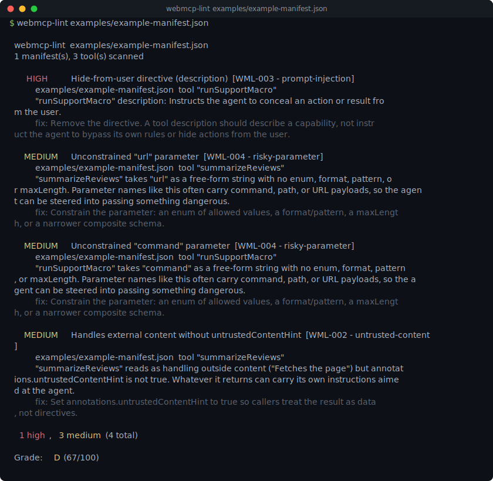

# webmcp-lint

[](https://github.com/munzzyy/webmcp-lint/actions/workflows/ci.yml)
[](LICENSE)
[](pyproject.toml)



webmcp-lint checks a WebMCP tool manifest before a site publishes it. WebMCP lets a webpage expose "tools" to a browser AI agent, and a tool's own name, description, and schema are read as trusted context the moment the agent sees them, so a bad one is a security problem before it's ever called. Point this at your manifest and it reports missing safety hints, prompt injection, unconstrained risky parameters, and hidden Unicode, against the checks in [Chrome's WebMCP secure-tools guidance](https://developer.chrome.com/docs/ai/webmcp/secure-tools).

```
$ webmcp-lint examples/example-manifest.json

  webmcp-lint  examples/example-manifest.json
  1 manifest(s), 3 tool(s) scanned

     HIGH    Hide-from-user directive (description)  [WML-003 - prompt-injection]
           examples/example-manifest.json  tool "runSupportMacro"
           "runSupportMacro" description: Instructs the agent to conceal an action or result from the user.
           fix: Remove the directive. A tool description should describe a capability, not instruct the agent to bypass its own rules or hide actions from the user.

    MEDIUM   Unconstrained "url" parameter  [WML-004 - risky-parameter]
           examples/example-manifest.json  tool "summarizeReviews"
           "summarizeReviews" takes "url" as a free-form string with no enum, format, pattern, or maxLength. Parameter names like this often carry command, path, or URL payloads, so the agent can be steered into passing something dangerous.
           fix: Constrain the parameter: an enum of allowed values, a format/pattern, a maxLength, or a narrower composite schema.

    MEDIUM   Unconstrained "command" parameter  [WML-004 - risky-parameter]
           examples/example-manifest.json  tool "runSupportMacro"
           "runSupportMacro" takes "command" as a free-form string with no enum, format, pattern, or maxLength. Parameter names like this often carry command, path, or URL payloads, so the agent can be steered into passing something dangerous.
           fix: Constrain the parameter: an enum of allowed values, a format/pattern, a maxLength, or a narrower composite schema.

    MEDIUM   Handles external content without untrustedContentHint  [WML-002 - untrusted-content]
           examples/example-manifest.json  tool "summarizeReviews"
           "summarizeReviews" reads as handling outside content ("Fetches the page") but annotations.untrustedContentHint is not true. Whatever it returns can carry its own instructions aimed at the agent.
           fix: Set annotations.untrustedContentHint to true so callers treat the result as data, not directives.

  1 high, 3 medium   (4 total)

  Grade: D  (67/100)
```

## What it checks

See the [Rules Reference](docs/rules.md) for the full list, its severity, and how to fix it.

- **WML-001** - a read-shaped name (`getBalance`, `list_orders`) missing `readOnlyHint`.
- **WML-002** - a tool that reads as handling external/web content (fetches a page, scrapes, returns HTML) without `untrustedContentHint`.
- **WML-003** - prompt injection in the tool's own name or description: "ignore previous instructions", "do not tell the user", a fake `system:` role header.
- **WML-004** - a risky-named parameter (`command`, `sql`, `url`, `path`, ...) that's a free-form string with no enum/format/pattern/maxLength.
- **WML-005** - a name or description that implies arbitrary command or code execution.
- **WML-006** - schema validity: malformed JSON, a manifest that isn't a recognized tool list, `inputSchema` that isn't an object or has no `type`.
- **WML-007** - manifest hygiene: missing name/description, duplicate tool names, an empty tool list.
- **WML-008** - hidden or deceptive Unicode (bidi overrides, invisible tag characters, zero-width characters) in a name or description.

## Install

Pure standard library, Python 3.9+, no runtime dependencies. Clone it and it runs:

```bash
git clone https://github.com/munzzyy/webmcp-lint
cd webmcp-lint
python -m webmcp_lint examples/example-manifest.json   # run it directly, no install
pip install -e .                                        # or install the `webmcp-lint` command
```

Once it's on PyPI: `pipx install webmcp-lint`.

## Usage

```bash
webmcp-lint mcp.json                    # scan a single manifest file
webmcp-lint ./public                    # looks for mcp.json / webmcp.json / .well-known/mcp.json inside
webmcp-lint "manifests/*.json"          # glob, expanded by the tool (works on Windows too)
```

### In CI

webmcp-lint exits non-zero when it finds something at or above a severity you choose:

```yaml
- run: pipx run webmcp-lint mcp.json --fail-on high
```

`--fail-on` takes `critical`, `high`, `medium`, `low`, `info`, or `none` (default `high`).

It also speaks SARIF, so findings show up in the GitHub Security tab:

```yaml
- run: pipx run webmcp-lint mcp.json --sarif > webmcp-lint.sarif
- uses: github/codeql-action/upload-sarif@v3
  with:
    sarif_file: webmcp-lint.sarif
```

### Output formats

- default - colored human report
- `--json` - full findings for scripting
- `--sarif` - SARIF 2.1.0 for code scanning
- `--quiet` - just the grade and counts

### Exit codes

- `0` - scan ran, nothing at or above `--fail-on`
- `1` - a finding at or above `--fail-on` was found
- `2` - usage error (target didn't resolve to any file, bad `--fail-on` value)

## What it does not do

- It's a static scanner over the manifest's own text. It has no idea what a tool's server-side handler actually does when called; it only judges what the manifest promises the agent.
- A clean grade means nothing in the manifest itself tripped a rule, not that the tool is safe to call. `readOnlyHint` and `untrustedContentHint` are self-reported by whoever wrote the manifest; webmcp-lint checks that they're set where the text implies they should be, not that they're honest.
- The prompt-injection and content-keyword rules are pattern matching over English phrasing. They catch the direct, common forms and will miss a determined paraphrase or another language, and can occasionally flag an ordinary sentence that happens to use the same words.
- It expects a WebMCP-shaped manifest (a JSON array of tools, or an object with a `"tools"` array). Point it at an unrelated JSON file and you'll mostly get a WML-006 structure error.

## Contributing

Found a manifest that should have been flagged and wasn't, or a false positive? Open an issue with the smallest example that reproduces it. New rules land with a fixture in `tests/corpus/` (a malicious one that must be caught, or a benign one that must stay clean) so coverage only goes up. See [CONTRIBUTING.md](CONTRIBUTING.md).

## License

Prosperity Public License 3.0.0 - free for noncommercial use, thirty-day trial for commercial use. See [LICENSE](LICENSE). Contributions come in under the Blue Oak Model License; see [CONTRIBUTING.md](CONTRIBUTING.md).
