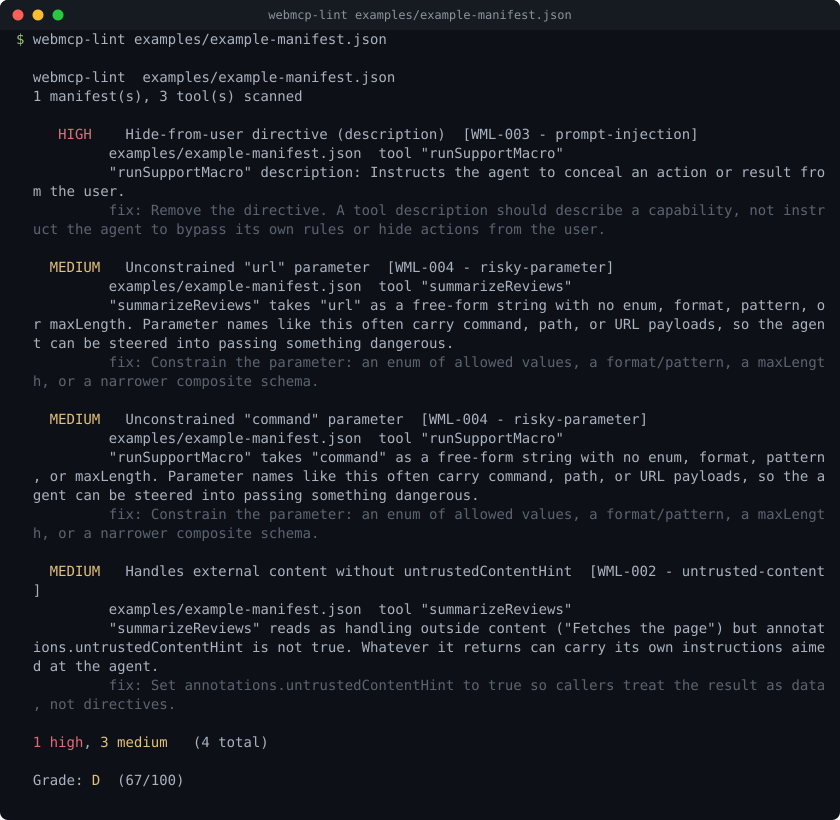

# webmcp-lint

[](https://github.com/munzzyy/webmcp-lint/actions/workflows/ci.yml)
[](LICENSE)
[](pyproject.toml)



webmcp-lint checks a WebMCP tool manifest before a site publishes it. WebMCP lets a webpage expose "tools" to a browser AI agent, and a tool's own name, description, and schema are read as trusted context the moment the agent sees them, so a bad one is a security problem before it's ever called. Point this at your manifest and it reports missing safety hints, prompt injection, unconstrained risky parameters, and hidden Unicode, against the checks in [Chrome's WebMCP secure-tools guidance](https://developer.chrome.com/docs/ai/webmcp/secure-tools).

```
$ webmcp-lint examples/example-manifest.json

  webmcp-lint  examples/example-manifest.json
  1 manifest(s), 3 tool(s) scanned

     HIGH    Hide-from-user directive (description)  [WML-003 - prompt-injection]
           examples/example-manifest.json  tool "runSupportMacro"
           "runSupportMacro" description: Instructs the agent to conceal an action or result from the user.
           fix: Remove the directive. A tool description should describe a capability, not instruct the agent to bypass its own rules or hide actions from the user.

    MEDIUM   Unconstrained "url" parameter  [WML-004 - risky-parameter]
           examples/example-manifest.json  tool "summarizeReviews"
           "summarizeReviews" takes "url" as a free-form string with no enum, format, pattern, or maxLength. Parameter names like this often carry command, path, or URL payloads, so the agent can be steered into passing something dangerous.
           fix: Constrain the parameter: an enum of allowed values, a format/pattern, a maxLength, or a narrower composite schema.

    MEDIUM   Unconstrained "command" parameter  [WML-004 - risky-parameter]
           examples/example-manifest.json  tool "runSupportMacro"
           "runSupportMacro" takes "command" as a free-form string with no enum, format, pattern, or maxLength. Parameter names like this often carry command, path, or URL payloads, so the agent can be steered into passing something dangerous.
           fix: Constrain the parameter: an enum of allowed values, a format/pattern, a maxLength, or a narrower composite schema.

    MEDIUM   Handles external content without untrustedContentHint  [WML-002 - untrusted-content]
           examples/example-manifest.json  tool "summarizeReviews"
           "summarizeReviews" reads as handling outside content ("Fetches the page") but annotations.untrustedContentHint is not true. Whatever it returns can carry its own instructions aimed at the agent.
           fix: Set annotations.untrustedContentHint to true so callers treat the result as data, not directives.

  1 high, 3 medium   (4 total)

  Grade: D  (67/100)
```

## What it checks

See the [Rules Reference](docs/rules.md) for the full list, its severity, and how to fix it.

- **WML-001** - a read-shaped name (`getBalance`, `list_orders`) missing `readOnlyHint`.
- **WML-002** - a tool that reads as handling external/web content (fetches a page, scrapes, returns HTML) without `untrustedContentHint`.
- **WML-003** - prompt injection in the tool's own name or description: "ignore previous instructions", "do not tell the user", a fake `system:` role header.
- **WML-004** - a risky-named parameter (`command`, `sql`, `url`, `path`, ...) that's a free-form string with no enum/format/pattern/maxLength.
- **WML-005** - a name or description that implies arbitrary command or code execution.
- **WML-006** - schema validity: malformed JSON, a manifest that isn't a recognized tool list, `inputSchema` that isn't an object or has no `type`.
- **WML-007** - manifest hygiene: missing name/description, duplicate tool names, an empty tool list.
- **WML-008** - hidden or deceptive characters (bidi overrides, invisible tag characters, zero-width characters, raw terminal escapes) in a tool's text.
- **WML-009** - text over Chrome's published size budgets: 30 characters for a tool or parameter name, 500 for a tool description, 150 for a parameter description.
- **WML-010** - an injection payload no single tool carries: one split across several tool descriptions, or hidden inside a base64, hex, or percent-encoded blob.
- **WML-011** - a manifest still pointing at `navigator.modelContext`, deprecated in Chrome 150. `document.modelContext` replaced it.

WML-003, WML-008 and WML-009 read the whole `inputSchema`, not only the tool's own fields. A parameter `description` goes to the model with the rest of the tool definition, which makes it the obvious place to hide something.

## Install

Pure standard library, Python 3.9+, no runtime dependencies.

```bash
pipx install git+https://github.com/munzzyy/webmcp-lint
webmcp-lint mcp.json
```

Or clone it and run it in place, no install at all:

```bash
git clone https://github.com/munzzyy/webmcp-lint
cd webmcp-lint
python -m webmcp_lint examples/example-manifest.json
pip install -e .                                        # or install the `webmcp-lint` command
```

It is not on PyPI, so `pipx install webmcp-lint` will not find it. Install from git until it is.

## Usage

```bash
webmcp-lint mcp.json                    # scan a single manifest file
webmcp-lint ./public                    # looks for mcp.json / webmcp.json / .well-known/mcp.json inside
webmcp-lint ./public --recursive        # also looks inside subdirectories
webmcp-lint "manifests/*.json"          # glob, expanded by the tool (works on Windows too)
webmcp-lint mcp.json .well-known/mcp.json   # several targets in one run
```

Several targets are scanned as one run with one grade. A file reached twice (`mcp.json ./mcp.json`) is only scanned once, and a target that matches nothing is a usage error even if the others matched.

`--recursive` (or `-r`) makes a directory target check every subdirectory too, skipping `node_modules`, `.git`, `dist`, `build`, `venv`, `.venv`, `__pycache__`, and `.tox`. Useful for a monorepo where the manifest lives a few levels down, e.g. `apps/web/mcp.json`. A top-level manifest always wins if there is one; `--recursive` only adds nested ones alongside it.

If a directory has none of the well-known JSON names at all, webmcp-lint falls back to checking its `index.html`, `index.htm`, `mcp.js`, and `webmcp.js` for a `registerTool(...)` call, since most real WebMCP tools live in JavaScript with no manifest file to point at (see the next section).

### pre-commit

You can run `webmcp-lint` as a [pre-commit](https://pre-commit.com/) hook. Add this to your `.pre-commit-config.yaml`:

```yaml
repos:
  - repo: https://github.com/munzzyy/webmcp-lint
    rev: v0.2.0 # replace with latest tag
    hooks:
      - id: webmcp-lint
```

The hook passes every staged `mcp.json`, `webmcp.json` and `.well-known/mcp.json` in one call, so a repo with more than one is linted in a single run.

### In CI

webmcp-lint exits non-zero when it finds something at or above a severity you choose:

```yaml
- run: pipx run --spec git+https://github.com/munzzyy/webmcp-lint@v0.2.0 webmcp-lint mcp.json --fail-on high
```

`--fail-on` takes `critical`, `high`, `medium`, `low`, `info`, or `none` (default `high`).

It also speaks SARIF, so findings show up in the GitHub Security tab:

```yaml
- run: pipx run --spec git+https://github.com/munzzyy/webmcp-lint@v0.2.0 webmcp-lint mcp.json --sarif > webmcp-lint.sarif
- uses: github/codeql-action/upload-sarif@v4
  with:
    sarif_file: webmcp-lint.sarif
```

### GitHub Action

Or skip wiring the above by hand and use the bundled composite action, which installs
webmcp-lint, scans, uploads the SARIF, and fails the job on your `fail-on` threshold in one step:

```yaml
permissions:
  contents: read
  security-events: write  # required so upload-sarif can write to the Security tab

jobs:
  webmcp-lint:
    runs-on: ubuntu-latest
    steps:
      - uses: actions/checkout@v5
      - uses: munzzyy/webmcp-lint@v0.2.0
        with:
          path: mcp.json      # file, directory, or glob (default: ".")
          fail-on: high        # default: high
          recursive: "false"   # also check subdirectories (default: "false")
          upload-sarif: "true" # send findings to the Security tab (default: "true")
```

The action installs webmcp-lint from its own copy, so pinning the action to a tag or a
commit SHA pins the linter it runs as well. `ref` installs a different tag or commit of
webmcp-lint instead, if you ever need that. SARIF upload always runs with every finding,
independent of `fail-on`. The threshold only decides whether the job itself passes or fails.
Set `upload-sarif: "false"` to skip the upload, for example on a token without
`security-events: write`. The SARIF file is still written and its path is in the
`sarif-file` output.

### Scanning JS or HTML source directly

There's no manifest file in the WebMCP spec: a page registers each tool at runtime with `document.modelContext.registerTool({...})`, and most real sites never produce a JSON file at all. Point webmcp-lint at that source instead:

```bash
webmcp-lint public/index.html
webmcp-lint src/tools.js
```

This is best effort, not a JS parser. It tokenizes the file, so strings, comments, template literals and regex literals are told apart from code, then finds each `registerTool(` call and reads the object literal passed to it. Single quotes, unquoted keys, trailing commas and comments inside the literal are fine, and the `execute` callback is skipped. In an HTML file only `<script>` contents count, so a call inside an HTML comment is ignored.

What it cannot read is a value it would have to run code to know: a tool built from a variable, a spread, a function call, or a template literal with `${...}`. Those call sites are not dropped. Each one is reported as a HIGH WML-006 finding with its line number, and a file where no call could be read grades F like any other file nothing inspected. A JSON manifest, when you have one, will always be scanned more completely.

### Suppressing a finding

The injection and content rules are pattern matching over English, so one of
them will eventually flag a sentence that happens to use the same words. Turn
that rule off rather than dropping `--fail-on` and losing the whole gate:

```bash
webmcp-lint mcp.json --ignore WML-002
webmcp-lint mcp.json --ignore WML-002,WML-004     # or repeat the flag
```

A suppressed rule is suppressed everywhere, in the report, the grade, and the
exit code, so what you see is what CI decides on. An unknown rule id is a
usage error rather than a silent no-op. The bundled action takes the same list
as its `ignore` input.

One thing you cannot suppress: a manifest webmcp-lint could not read. Hiding
that would turn a file nothing inspected into a clean grade, which is the one
result this tool must never produce.

If a rule is wrong rather than noisy for you, please open an issue with the
manifest that trips it. That is how the corpus grows.

### Output formats

- default - colored human report
- `--json` - full findings for scripting
- `--sarif` - SARIF 2.1.0 for code scanning
- `--quiet` - just the grade and counts

### Exit codes

- `0` - scan ran, nothing at or above `--fail-on`
- `1` - a finding at or above `--fail-on` was found
- `2` - usage error (a target didn't resolve to any file, bad `--fail-on` value)

## What it does not do

- It's a static scanner over the manifest's own text. It has no idea what a tool's server-side handler actually does when called; it only judges what the manifest promises the agent.
- A clean grade means nothing in the manifest itself tripped a rule, not that the tool is safe to call. `readOnlyHint` and `untrustedContentHint` are self-reported by whoever wrote the manifest; webmcp-lint checks that they're set where the text implies they should be, not that they're honest.
- The prompt-injection and content-keyword rules are pattern matching over English phrasing. They catch the direct, common forms and will miss a determined paraphrase or another language, and can occasionally flag an ordinary sentence that happens to use the same words.
- It expects a WebMCP-shaped manifest (a JSON array of tools, or an object with a `"tools"` array). Point it at an unrelated JSON file and you get a WML-006 structure error, grade F, and a non-zero exit. That is deliberate: a file the linter could not read has not been checked, and a scan that checked nothing must not look like a pass.
- WebMCP tools are registered in JavaScript, with `document.modelContext.registerTool(...)`. You can point webmcp-lint at a JSON tool list you produce (an MCP `tools/list` response, a build-time export of your `registerTool` arguments, or a hand-written file), or at the JS/HTML source itself. The source scanner is a tokenizer, not a JS parser: it reads a literal object argument and nothing more. A tool assembled from a variable, a spread, or a template literal with interpolation cannot be checked, and the report says so with a HIGH finding on that line instead of passing it. A JSON manifest is always the more complete input.

## Contributing

Found a manifest that should have been flagged and wasn't, or a false positive? Open an issue with the smallest example that reproduces it. New rules land with a fixture in `tests/corpus/` (a malicious one that must be caught, or a benign one that must stay clean) so coverage only goes up. See [CONTRIBUTING.md](CONTRIBUTING.md).

## License

[GPL-3.0-or-later](LICENSE). You can use, study, change and share it. If you distribute a copy or a modified version, it has to stay under the GPL and come with its source. Releases up to v0.1.1 were under MIT.

## Support

If webmcp-lint flagged a manifest before it shipped, [sponsoring](https://github.com/sponsors/munzzyy) is what keeps the rules current.
